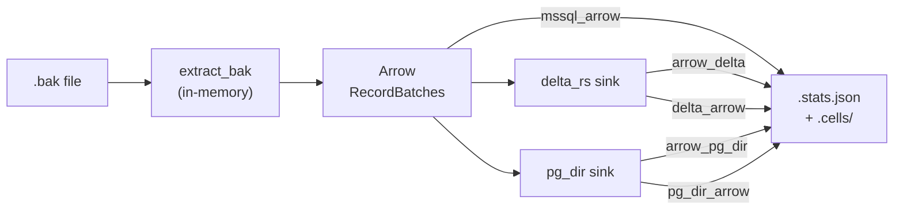

# mssqlbak-tests

Offline correctness harness for the `mssqlbak` pure-Python `.bak` decoder.

## Strategy

Each `.bak` fixture is decoded once in memory to Apache Arrow, fanned out through round-trip storage sinks (`delta_rs`, `pg_dir`), and every stage compared against SQL Server ground truth collected from a live instance.



Three comparison edges per sink:

| Edge | What it checks |
|---|---|
| `mssql_arrow` | decoder correctness: decoded Arrow vs SQL Server ground truth |
| `arrow_<sink>` | write fidelity: decoded Arrow vs read-back from the sink |
| `<sink>_arrow` | end-to-end: read-back from the sink vs SQL Server ground truth |

## Verification levels

**Digest mode** (`--verify digest`, default): per-column multiset SHA-256 digest plus a key-ordered digest. Catches any set-level value corruption and row transpositions; no GT parquet read and no per-row Python loop. Fast enough to run on every fixture.

**Full mode** (`--verify full`): exhaustive keyed row-level compare via `pc.take` + `pc.equal`. Populates `res.samples` with `(key, column, decoded_value, expected_value)` tuples to pinpoint the failing cell when debugging a decoder issue.

**None mode** (`--verify none`): skips cell verification; row counts, null counts, and min/max still run.

## Ground truth

`tools.fixture_run register-bak <path/to.bak>` restores the backup to a live SQL Server container and writes:

- `<bak>.stats.json` — per-table row counts, per-column null counts and min/max values.
- `<bak>.cells/_manifest.json` — per-column SHA-256 digests over the full column.
- `<bak>.cells/<schema.table>.parquet` — canonical cell strings for keyed tables (full or sampled rows).

`tools.fixture_run all-versions` regenerates all fixtures across every running SQL Server version (2017 / 2019 / 2022 / 2025) and runs `register-all` to refresh the sidecars.

## Quick start

```bash
# Regenerate the correctness coverage doc for the default fixture set
python -m tools.correctness_coverage

# Single fixture, print to stdout, full cell compare
python -m tools.correctness_coverage tests/fixtures_realworld/Chinook.bak --no-write --verify full

# Same run but exercising the HTTP remote-reader path
python -m tools.correctness_coverage tests/fixtures_realworld/Chinook.bak --no-write --http
```

## Docs

- [docs/correctness_coverage.md](docs/correctness_coverage.md) — verifier tool reference
- [docs/fixture_run.md](docs/fixture_run.md) — fixture generation and ground-truth capture
