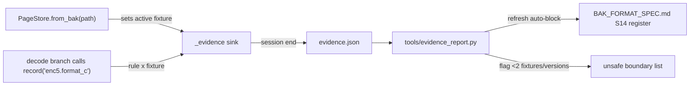

# Evidence Tracking System

**Date:** 2026-06-19
**Status:** Plan — not yet implemented
**Scope:** (R1) a project-skill rule requiring multi-fixture corroboration during
investigation, and (R2) an auto-instrumented evidence-count system that records
which `.bak` fixtures exercise each decode rule and surfaces single-fixture
"unsafe" boundary areas.

**Related:**
- [`BAK_FORMAT_SPEC.md`](BAK_FORMAT_SPEC.md) §0 — confidence ladder, register conventions
- [`CORROBORATION_SOURCES.md`](CORROBORATION_SOURCES.md) — external-source SSOT
- [`260619-1-varbinary-bak.md`](260619-1-varbinary-bak.md) — the fixture specs that motivated this
- [`.cursor/skills/format-reverse-engineering/SKILL.md`](../.cursor/skills/format-reverse-engineering/SKILL.md)
- [`.cursor/skills/mssqlbak-fixtures/SKILL.md`](../.cursor/skills/mssqlbak-fixtures/SKILL.md)

---

Two deliverables from two requests:

- **R1 — skill rule:** during investigation, pause and generate additional surgical `.bak` files to corroborate an assumption instead of trusting one `.bak`.
- **R2 — evidence-count system:** auto-instrumented, hybrid home — stable rule-ID `Evidence:` tags in code docstrings, counts computed from test runs, aggregated into a register in `BAK_FORMAT_SPEC.md`.

## Answer to "code comments or BAK_FORMAT_SPEC.md?"

Neither alone. The *count* must not live in free-form code comments — comments can't be aggregated and drift from reality. The split is:

- **Code** carries only a stable rule-ID tag (`Evidence: enc5.format_c`) in the docstring, next to the logic.
- **The count** is computed by an instrumented test run (every `PageStore.from_bak` sets the "active fixture"; every decode branch records its rule-ID against it).
- **`BAK_FORMAT_SPEC.md`** hosts an auto-generated register table (refreshed by a tool), where rows with `< 2` fixtures or `< 2` SQL Server versions are flagged `unsafe` — the boundary areas needing more `.bak` files.

## R1 — Multi-fixture corroboration rule

Edit [.cursor/skills/format-reverse-engineering/SKILL.md](../.cursor/skills/format-reverse-engineering/SKILL.md): add a section **"Corroborate with multiple fixtures — never trust a single .bak"**:

- Before promoting a decode rule above `[EMPIRICAL]` or concluding an investigation, pause and generate >=1 additional surgical `.bak` varying the assumption (value width, row count, null density, ordering, and SQL Server version).
- A rule exercised by exactly one `.bak` (or one version) is a single-fixture **unsafe boundary** and must show as `unsafe` in the evidence register.
- Fold this into the existing iteration-budget cycle (it becomes the gate on the bottom-up -> promotion transition) and cross-link the `mssqlbak-fixtures` skill + the new register.

## R2 — Auto-instrumented evidence system

### 1. `mssqlbak/_evidence.py` (new)
- `RULES: dict[str, SpecRef]` — the single declaration of every decode rule-ID with its spec section + one-line description. This is the denominator (declared rules).
- `record(rule_id)` — near-zero-cost no-op when inactive (`if _SINK is None: return`); when active, adds `rule_id` to `_SINK[rule_id]["fixtures"/"versions"]` against the current active fixture. Validates `rule_id in RULES`.
- `set_active_fixture(path)` / `enable()` / `disable()` / `dump(path)`; active fixture = `.bak` stem, version = parent dir (`fixtures_2022` -> `2022`).

### 2. Hook the universal entry point
In `PageStore.from_bak` (`mssqlbak/pages.py`), call `_evidence.set_active_fixture(path)` so any `.bak` load — test or diagnostic — sets the active fixture with no per-test wiring.

### 3. Seed rule tags (phase 1: the risky area)
In [mssqlbak/columnstore.py](../mssqlbak/columnstore.py), add one `record(...)` call + matching `Evidence:` docstring tag per encoding branch, starting with the `[EMPIRICAL]`-ceiling paths: `_decode_enc5` Format A/B/C/D branches, `_decode_enc5_compressed`, `_decode_enc5_archive`, `_decode_enc5_archive_subblock_compressed`, plus `_decode_enc2` / `_decode_enc3` (incl. char/binary/uuid dict sub-paths). Mechanism is generic for later expansion to `types.py`, `records.py`, `rowcompress.py`.

### 4. Test harness integration
In [tests/conftest.py](../tests/conftest.py): when `MSSQLBAK_EVIDENCE=1`, `pytest_configure` enables the recorder and `pytest_sessionfinish` dumps `evidence.json`. No change to individual tests; counts accrue across the whole suite (run per version via `FIXTURE_DIR`).

### 5. `tools/evidence_report.py` (new)
- Reads `evidence.json` (merging multiple version runs).
- Renders a register table: `rule_id | spec section | #fixtures | #versions | fixtures | safety`.
- `safety = unsafe` when `#fixtures < 2` or `#versions < 2`; declared-but-never-exercised rules (0 evidence) listed first as highest priority.
- Refreshes an auto-generated block in `BAK_FORMAT_SPEC.md` between `<!-- BEGIN evidence-register -->` / `<!-- END evidence-register -->` sentinels (idempotent; safe inside the hand-maintained 2288-line doc).
- `--check` mode exits non-zero if any declared rule has 0 evidence (catches dead/untested tags in CI).

### 6. `docs/BAK_FORMAT_SPEC.md`
- New section **§14 Decode Rule Evidence Register (auto-generated)** with the sentinel block.
- One-line summary near the §0 confidence summary pointing at §14, and a short paragraph in §0 documenting the mechanism (code tag -> instrumented run -> computed count).

### 7. Anti-drift test
`tests/test_evidence_registry.py`: assert every `record("X")` literal in the codebase has `X in RULES`, and every `RULES` id appears in exactly one `Evidence:` docstring tag — keeps code tags, IDs, and register in sync.

## Verification
- `MSSQLBAK_EVIDENCE=1 .venv/bin/python -m pytest tests/test_columnstore.py tests/test_cci_types_large_coverage.py` produces `evidence.json`.
- `.venv/bin/python -m tools.evidence_report` refreshes §14; confirm enc=5 Format C shows `unsafe` (single fixture) as expected.
- `.venv/bin/python -m tools.evidence_report --check` and the anti-drift test pass.

## Implementation todos

- [ ] **skill_rule** — Add 'Corroborate with multiple fixtures' rule to `.cursor/skills/format-reverse-engineering/SKILL.md`, folded into the iteration-budget cycle with cross-links to the evidence register and mssqlbak-fixtures skill
- [ ] **evidence_module** — Create `mssqlbak/_evidence.py`: RULES registry (id -> spec section + description), `record()` no-op-when-inactive hook, active-fixture context, enable/disable/dump
- [ ] **frombak_hook** — Call `_evidence.set_active_fixture(path)` inside `PageStore.from_bak` in `mssqlbak/pages.py`
- [ ] **seed_rules** — Add `record()` calls + matching `Evidence:` docstring tags to `columnstore.py` decode branches (enc=5 Format A/B/C/D, compressed, archive, sub-block; enc=2; enc=3 char/binary/uuid)
- [ ] **conftest_hook** — Wire `tests/conftest.py` to enable the recorder and dump `evidence.json` under `MSSQLBAK_EVIDENCE=1` (pytest_configure + pytest_sessionfinish)
- [ ] **report_tool** — Create `tools/evidence_report.py`: merge `evidence.json`, render register, flag unsafe (<2 fixtures/versions), refresh `BAK_FORMAT_SPEC.md` auto-block, `--check` mode
- [ ] **spec_section** — Add `BAK_FORMAT_SPEC.md` §14 sentinel block + §0 summary line and mechanism paragraph
- [ ] **antidrift_test** — Add `tests/test_evidence_registry.py` asserting `record()` ids, RULES, and docstring `Evidence:` tags stay in sync
- [ ] **verify** — Run instrumented suite, generate `evidence.json`, refresh register, confirm enc=5 Format C flagged unsafe; run `--check` and anti-drift test
