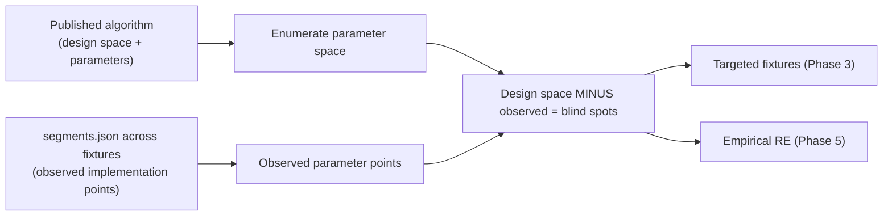
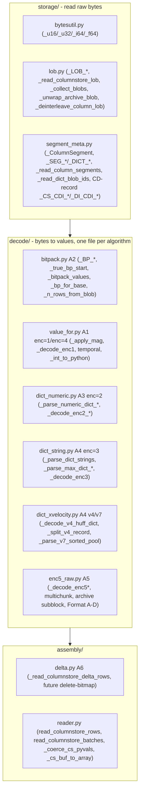
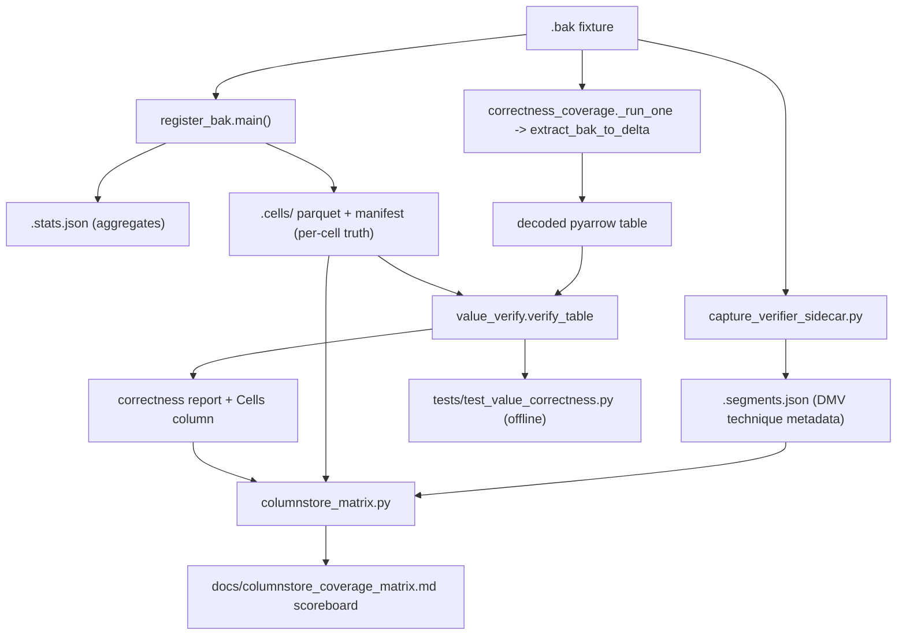

# Columnstore `.bak` Coverage Overhaul

**Goal:** `mssqlbak` decodes every cell correctly (not just aggregates) for any
columnstore `.bak` across the supported type/technique/organization/version
matrix, measured by a coverage matrix that shows exactly which cells are
exercised and which still fail.

**Created:** Jun 2026  
**Status:** planning — not yet started  
**Related docs:** `CORROBORATION_SOURCES.md`, `BAK_FORMAT_SPEC.md`, `Columnstore indexes have evolved from a .md`, `SS2022_FULL_COVERAGE_PLAN.md`

> This is the committed project copy. The live working copy (with Cursor plan-mode
> todo tracking) lives at `~/.cursor/plans/columnstore_coverage_overhaul_ccba641f.plan.md`.
> Keep the two in sync when the plan changes materially.

---

## Work items

- **known-gaps-ssot** (before Phase 0): consolidate the two drifting `_KNOWN_GAPS`
  dicts (`tools/correctness_coverage.py` + `tests/test_stats.py`) into one shared
  module so the coverage doc and pytest agree.
- **register-bak-stable** (before Phase 0): stop `register_bak` rewriting volatile
  `.stats.json` metadata (`database`/`registered_at`/`sqlserver_restore_s`) that
  creates spurious diffs; canonicalize/omit those fields or add `--verify-only`.
- **diag-rowgroups** (after Phase 0): add a `rowgroups` subcommand to
  `tools/diag/_cli.py` that reconciles per-rowgroup `n_rows` against `rcrows`
  (flags tombstones) and overlays live `sys.column_store_row_groups` state.
- **segments-state** (Phase 2): add row-group `state_desc` + a live-vs-total
  reconciliation to the `segments.json` capture.
- **reorg** (Phase 0): split `mssqlbak/columnstore.py` (~4450 lines) into a package
  `mssqlbak/columnstore/` by pipeline layer (`storage/` `decode/` `assembly/`),
  decode sub-split by algorithm; keep the ~3 version-divergent branches inline with
  a greppable `# VERSION: <Vnn>` comment convention (no `version_quirks.py`);
  `__init__.py` re-exports the public API and the private symbols imported by
  `tools/diag/*` and `tools/spec_probe.py`; mechanical move only, byte-identical
  output gated on `test_columnstore.py` + `correctness_coverage`; own PR.
- **algo-map**: produce `docs/columnstore_algorithm_map.md` (living): per published
  algorithm, map source token -> what the paper fixes -> mssqlbak code anchor ->
  observed parameter points (from `segments.json`) -> unobserved blind spots.
- **verifier** (Phase 1): row-level value verifier — extend `register-bak` to emit
  `<bak>.cells/` ground truth, add `tools/value_verify.py`, wire into
  `correctness_coverage.py` and a new `tests/test_value_correctness.py`.
- **matrix-instr** (Phase 2): extend `segments.json` capture to all columnstore
  fixtures; add `tools/columnstore_matrix.py` to emit
  `docs/columnstore_coverage_matrix.md` scoreboard.
- **backfill**: backfill `.cells/` and `segments.json` for all existing fixtures
  across 2017/2019/2022/2025; record the baseline matrix.
- **fill-fixtures** (Phase 3): generators for empty matrix cells.
- **decoder-fixes** (Phase 4): close decoder gaps surfaced by the verifier.
- **empirical-re** (Phase 5): reverse-engineer remaining `[EMPIRICAL]` formats.

---

## Why now

The `tpcxbb` `c_email_address` fix exposed a structural blind spot: the coverage
report ([tools/correctness_coverage.py](../tools/correctness_coverage.py)) compares
only **row count, null count, min/max, col count** against
`<bak>.bak.stats.json`. The column showed all-green (null/min-max/col) while
~92% of decoded *row values* were wrong. Aggregate stats cannot catch per-row
value corruption, dictionary mis-indexing, or row-order permutation.

Separately, the [columnstore evolution doc](Columnstore%20indexes%20have%20evolved%20from%20a%20.md)
spans 2012-2025 (read-only CCI -> CCI+delta -> NCCI/heap -> ordered CCI ->
online rebuild), and the decoder ([mssqlbak/columnstore.py](../mssqlbak/columnstore.py))
already covers enc=1..5, dict v2/v4/v7, and ARCHIVE - but coverage of the full
cross-product of {type} x {technique} x {organization} x {version} is uneven and
unmeasured.

## Goal

`mssqlbak` decodes **every cell** correctly (not just aggregates) for any
columnstore `.bak` across the supported type/technique/organization/version
matrix, with a measurable coverage matrix that shows exactly which cells are
exercised and which still fail.

## Coverage matrix (4 axes)

- **Data type**: full `TYPE_CASES` from [tools/typematrix.py](../tools/typematrix.py)
  minus `COLUMNSTORE_SKIP` (text/ntext/image/xml/sql_variant/rowversion/hierarchyid/geometry/geography),
  i.e. int family, decimal/numeric, money, real/float, date/time/datetime/datetime2/smalldatetime/datetimeoffset,
  char/nchar/varchar/nvarchar, varchar(max)/nvarchar(max)/varbinary(max), binary/varbinary, uniqueidentifier, bit, json.
- **Encoding technique**: enc=1 (value/FOR), enc=2 (numeric dict int/float), enc=3 (string dict: v2 small, v4 Huffman, v7 sorted-pool, MAX-dict, bitpack direct/compact-RLE/hybrid-RLE), enc=4 (raw 64-bit), enc=5 (Format A-D raw/off-row, multichunk XPRESS), ARCHIVE (single/multi-chunk, double-compressed sub-blocks), ordered CCI.
- **Table organization**: CCI, NCCI-on-rowstore, NCCI-on-heap, filtered NCCI, partitioned CCI, multi-rowgroup, open delta store, delete bitmap (delete/update), partition SWITCH, CCI+B-tree NCI, computed columns.
- **SQL version**: 2017, 2019, 2022, 2025 (fixtures already replicated across `tests/fixtures_{2017,2019,2022,2025}`).

## Algorithm-to-implementation map (the blind-spot model)

Key premise: SQL Server engineers and academics **publish the algorithms**
(Larson, Zukowski, Abadi, Lemire, MS-XCA/MS-XLDM specs), while the **on-disk
implementation is closed** and we reverse-engineer it from fixtures. Therefore the
safest way to find blind spots is:



For each algorithm below: the **published source**, **what the paper/spec
fixes**, **how mssqlbak addresses it today (code anchor)**, and the **likely
blind spot** = the part of the published design space we have not yet observed.

### A1. Value encoding / Frame-of-Reference (FOR) - enc=1, enc=4

- **Source**: `L11` §2.2.1, `Z09` §6.2, `STAIR4`, Paul White (DBCC CSINDEX).
- **What is fixed**: per-segment base + scale; `actual = base_id + stored * magnitude`.
- **mssqlbak**: `_apply_mag()`, `_bp_for_base()`, value path lines 1180-1232.
- **Blind spots**: (1) negative-exponent decimal vs integer scale per precision;
  (2) `null_value` sentinel for small segments (C1a); (3) bigint 64-bit boundary
  for `base_id + stored` (unverified). Note: `cci_bitpack_probe_bigint` is **not**
  a FOR/boundary bug - its failure is a row-group tombstone overshoot (A6).

### A2. Bit-packing (BP) - primitive under enc=1/2/3

- **Source**: `LB15`/FastPFor, `FASTLANES23`, `WILLHALM09`, Paul White (7x9-bit).
- **mssqlbak**: pure path `vpw = 64 // bpv`, `_true_bp_start()`, lines 1208-1232.
- **Blind spots**: (1) all `bpv` widths per type; (2) 32,256/32,768 boundary;
  (3) `bpv=0` off-row MAX returns `None`; (4) possible 2022/2025 lane-layout change.

### A3. RLE and hybrid RLE+bitpack - enc=1/2/3

- **Source**: `ABADI06`, `L11` §2.2.3.
- **mssqlbak**: hybrid fragment table + bit-offset refs vs RLE runs, lines 1234-1265.
- **Blind spots**: (1) pure-RLE-only segments; (2) fragment `field1` block-type
  (`Z09` note); (3) very long runs.

### A4. Dictionary encoding - enc=3 (v2 / v4 Huffman / v7 sorted-pool)

- **Source**: `L11`/`L15`, `MS-XLDM` §2.3.2, `MS-DICT`, `XMHUFFMAN`, VertiPaq family.
- **mssqlbak**: `_decode_v4_huff_dict()`, `_split_v4_record()`,
  `_parse_v7_sorted_pool()`; v4 confirmed 1200/1200 vs `G44.json`.
- **Blind spots**: (1) v7 compact step format; (2) `dict_type` 1/3/4 cross-product;
  (3) fragile `CHAR(N)` split heuristic; (4) sort-key-only dicts; (5) shared/global
  dictionaries.

### A5. XPRESS / MS-XCA Huffman - enc=5 multichunk, ARCHIVE

- **Source**: `MS-XCA`, Kraft-McMillan, `L13` (ARCHIVE layer).
- **mssqlbak**: XPRESS + 64 KiB multichunk; ARCHIVE single-layer.
- **Blind spots**: (1) ARCHIVE double-compressed inner sub-block; (2) enc=5 Format
  A-D byte layouts (`[EMPIRICAL]`); (3) 32,768-row null-bitmap sub-block.

### A6. Delta store + delete/update bitmap - CCI updateability (SS2014+)

- **Source**: `L13`, `HEMAN10`, Korotkevitch, `N32`, Neugebauer part 22.
- **mssqlbak**: delta rows read; **delete bitmap not parsed** (`_KNOWN_GAPS`,
  `correctness_coverage.py` lines 58-70).
- **Blind spots**: (1) delete-bitmap application; (2) state_desc handling;
  (3) compression-delay open delta.

### A7. Ordered CCI + segment elimination (SS2022), online rebuild (SS2025)

- **Source**: evolution doc sections 5-6.
- **mssqlbak**: ordered CCI decodes via same path (one fixture today).
- **Blind spots**: (1) ordered vs unordered byte differences per type;
  (2) SS2025 online-rebuild structural changes.

### A8. NCCI on heap / rowstore / filtered (SS2016+)

- **Source**: evolution doc section 3, `RG-CCI1/2`.
- **Blind spots**: (1) NCCI delete-bitmap; (2) filtered-NCCI row subset;
  (3) B-tree NCI interplay.

### A9. Columnstore on memory-optimized (Hekaton/XTP) - out of scope

- **Source**: `H13`, `FREED14`, `HKCC12`.
- **mssqlbak**: XTP tables detected and skipped; record as `absent (scoped out)`.

### How this drives the plan

- Phase 2's `columnstore_matrix.py` = the observed-points half of the diagram.
- Phase 3 fixtures hit unobserved points (A1-A8 blind spots).
- Phase 5 promotes `[EMPIRICAL]` -> `[CORROBORATED]`/`[CONFIRMED]` for inferred
  byte layouts (A4 v7 compact, A5 Format A-D / ARCHIVE inner, A6 delete bitmap).

## Repository touch-points (where each change lands)

- **Ground-truth capture** in [tools/register_bak.py](../tools/register_bak.py):
  `main()` (line ~782) -> `_collect_stats()` (line 599) -> `stats` dict (line 846).
  Live connection: `_run_sql_query()` (line 124) and
  `tools/fixture_utils.connect(...)`. Cell capture is added here.
- **Segment/DMV capture** in
  [tools/capture_verifier_sidecar.py](../tools/capture_verifier_sidecar.py)
  (dumps `sys.column_store_segments` + `_row_groups`; query ~195). Phase 2 extends.
- **Comparison** in [tools/correctness_coverage.py](../tools/correctness_coverage.py):
  `_run_one()` (line 237) -> `extract_bak_to_delta()` (250) -> pyarrow `tbl` (264).
  Verifier plugs in here.
- **Offline tests**: [tests/test_stats.py](../tests/test_stats.py) is the template;
  new `tests/test_value_correctness.py` mirrors its loop but diffs cells.
- **Decoder**: [mssqlbak/columnstore.py](../mssqlbak/columnstore.py) for Phase 4.

## Diagnostic playbook & tooling upgrades (lessons from the v4-dict + tombstone sessions)

This precedes Phase 0 deliberately: the lessons below are cross-cutting reference
that should frame every phase, and two of the tooling items are quick,
reorg-independent wins worth landing first. Execution sequencing: the methodology
plus `known-gaps-ssot` and `register-bak-stable` land **before** Phase 0;
`diag-rowgroups` executes **right after** Phase 0 (it edits
[tools/diag/_cli.py](../tools/diag/_cli.py), whose import surface the reorg
changes); `segments-state` folds into the Phase 2 `segments.json` query.

### Methodology (feeds the `decode-bug-workflow` + `mssqlbak-diag` skills)

- **Live DMV is the fastest ground truth for CCI lifecycle questions.** When
  extracted row/cell counts disagree, restore the `.bak` to the version-matched
  container and query the row-group/segment DMVs rather than guessing from bytes:

  ```bash
  FIXTURE_CONTAINER=robert-lee-mssql-2022-... \
    python -m tools.register_bak tests/fixtures_2022/<name>.bak --keep --db-name Probe
  # then: SELECT row_group_id, state, total_rows, deleted_rows
  #       FROM sys.column_store_row_groups ... ORDER BY row_group_id;
  ```

  The page image hides COMPRESSED / TOMBSTONE / OPEN state; the DMV resolves it in
  seconds. This is how `cci_bitpack_probe_bigint` was diagnosed: live set
  `{seg 0,3,4}` = 2,200,000, tombstones `{seg 1,2}` overshoot to 2,704,896.
- **Page-only signal audit before declaring a fix feasible or impossible.**
  Enumerate every page-level signal and test each for correlation with the unknown
  (here, row-group state): `syscscolsegments` record bytes (byte-diff within vs
  across row groups), segment blob headers, `seg_id` ordering, `blob_id` ordering,
  and the `rcrows` subset-sum. Record which are state-agnostic. For the bigint case
  all five were state-agnostic, proving the gap is structural - state lives only in
  the internal `fn_column_store_row_groups` TVF, not in any parsed structure.
- **`rcrows` subset-sum is ambiguous.** When the per-rowgroup `n_rows` sum exceeds
  `rcrows`, multiple subsets can total `rcrows` (`{0,1,2,3}` and `{0,3,4}` both =
  2,200,000). `rcrows` alone cannot identify the live set - go to the DMV.
- **Regression vs newly-exposed gap triage.** Before assuming a code regression,
  check `git show HEAD:<doc>` vs the working tree, the fixture mtime, and
  `git ls-files`. The bigint "regression" was a committed fixture newly surfaced by
  a coverage-doc regeneration, not a code change.

### Tooling work items

- **`known-gaps-ssot`** (before Phase 0, quick win): the two `_KNOWN_GAPS` dicts
  drift - `dirtycoverage_cci_delete`/`_update`, `dirtycoverage_committed_delete_v4`,
  `dirtycoverage_committed_update_v2`, and `tde_full` are `~` in the doc but still
  FAIL `FIXTURE_DIR=tests/fixtures_2022 pytest tests/test_stats.py`. Consolidate
  [tools/correctness_coverage.py](../tools/correctness_coverage.py) `_KNOWN_GAPS`
  and [tests/test_stats.py](../tests/test_stats.py) `_KNOWN_GAPS` into one shared
  module so the doc and the test agree.
- **`register-bak-stable`** (before Phase 0, quick win): re-running `register_bak`
  rewrites volatile `database` / `registered_at` / `sqlserver_restore_s` fields in
  `.stats.json`, producing spurious git diffs. Canonicalize/omit volatile fields or
  add a `--verify-only` mode that compares without rewriting.
- **`diag-rowgroups`** (after Phase 0): add a `rowgroups <table>` subcommand to
  [tools/diag/_cli.py](../tools/diag/_cli.py) that dumps per-`(hobt, seg_id)`:
  metadata `n_rows`, blob-derived `n_rows`, encodings, `blob_id`s, plus the rowset
  `rcrows`/compression; flags `sum(n_rows) > rcrows` (tombstones present) and lists
  candidate live subsets, with an optional `--dmv` overlay that restores + queries
  `sys.column_store_row_groups` for ground-truth state. One command would have
  answered the bigint question.
- **`segments-state`** (fold into Phase 2): add row-group `state_desc` + a
  live-vs-total reconciliation to the `segments.json` capture so the sidecar becomes
  the offline verifier for the tombstone filter.

### Decoder note (cross-links A6)

The tombstone filter "newest `seg_id` wins" heuristic
([mssqlbak/columnstore.py](../mssqlbak/columnstore.py) ~3822-3870) is correct for
REORGANIZE merges but wrong for `COMPRESS_ALL_ROW_GROUPS`, where tombstones are
mid-sequence. Recorded as a `_KNOWN_GAPS` entry; correct resolution needs the
row-group directory (absent from this fixture's page image) - see A6 blind spots.
The decode-level v4-dict and enc=5 findings from these sessions are already captured
as A4/A5 blind spots.

## Phase 0 - Reorganize `columnstore.py` into a package (maintainability)

[mssqlbak/columnstore.py](../mssqlbak/columnstore.py) is ~4,450 lines and growing.
Before adding more (verifier hooks, delete-bitmap, Format A-D), split into a package
so each algorithm is independently navigable and Phase 4-5 diffs stay small.

### Why not split by SQL version (2017/2022/2025)

**Recommendation: no, not as the primary axis.** ~90% of decoder code is
version-agnostic. Real version differences are narrow and catalogued in
[docs/BAK_FORMAT_SPEC.md](BAK_FORMAT_SPEC.md) §12 (`Vnn`): V05 enc=2-vs-enc=1 null
sentinel (2016->2017), V07 ARCHIVE (2014), ordered CCI (2022), online rebuild (2025).
Splitting by version would duplicate the shared code and orphan cross-version
functions. Version belongs in a thin comment convention, not the top-level structure.

### Recommended: split by pipeline layer, decode sub-split by algorithm



### Version handling: a comment convention, NOT a module

There are **no `Vnn` tags in `columnstore.py`** (those live in
[docs/BAK_FORMAT_SPEC.md](BAK_FORMAT_SPEC.md) §12), and only ~3 genuinely
version-divergent branches exist, each tightly coupled to its encoding. Keep them
inline and mark each with a greppable `# VERSION: <Vnn from BAK_FORMAT_SPEC §12>`
comment. The complete current list:

- **enc=2 "non-biased" magnitude + null sentinel** ("SQL Server 2016 and earlier"):
  lines 1879, 2110-2111, inside `_decode_enc1` -> stays in `decode/value_for.py`. (V05)
- **`prim_dict` vs `sec_dict` selection** for older versions (line 3966), inside the
  row reader -> stays in `assembly/reader.py`.
- **ARCHIVE (cmprlevel=4) detection** (lines 3927-3963) -> storage-flag check in
  `assembly/reader.py` / `storage/lob.py`. (V07)

`rg "# VERSION:" mssqlbak/columnstore/` becomes the canonical inventory.

### Concrete current-to-target mapping (line ranges from today's file)

- `bytesutil.py`: `_u16/_u32/_i32/_u64/_i64/_f64` (250-272).
- `storage/lob.py`: `_LOB_*` (141-187), `_read_large_root_data` (318),
  `_unwrap_archive_blob` (344), `_deinterleave_column_lob` (695),
  `_read_columnstore_lob` (714), `_collect_blobs` (769).
- `storage/segment_meta.py`: `_ColumnSegment` (234), `_SEG_*`/`_DICT_*` (116-138),
  CD-record `_CS_CDI_*`/`_DI_CDI_*` (880-922), `_walk_pages`/`_cd_records` (938-953),
  `_read_column_segments` (975), `_read_dict_blob_ids` (1051).
- `decode/bitpack.py`: `_BP_*` (191-218), `_bp_for_base` (274), `_n_rows_from_blob`
  (288), `_true_bp_start` (1384), `_bitpack_values` (1421).
- `decode/value_for.py`: `_apply_mag` (1781), `_decode_enc1` (1855), temporal (228).
- `decode/dict_numeric.py`: `_parse_numeric_dict_float/int` (1104-1132),
  `_decode_enc2_int_dict` (1160), `_decode_enc2_float_dict` (1268).
- `decode/dict_string.py`: `_parse_max_dict_*` (1469-1581), `_parse_dict_strings`
  (1593), `_decode_enc3` (2139).
- `decode/dict_xvelocity.py`: `_find_v7_sorted_pool` (471), `_parse_v7_sorted_pool`
  (491), `_decode_v4_huff_dict` (528), `_split_v4_record` (669).
- `decode/enc5_raw.py`: all `_enc5_*` + `_decode_enc5*` (2321-3670 region).
- `assembly/delta.py`: `_read_columnstore_delta_rows` (3670).
- `assembly/reader.py`: `read_columnstore_rows` (3782), `read_columnstore_batches`
  (4128), `_coerce_cs_pyvals` (4094), `_cs_buf_to_array` (4112).

### Hard constraint: preserve the import surface

Convert `mssqlbak/columnstore.py` into a package whose `__init__.py` re-exports the
public API **and** the private symbols external callers import:

- `read_columnstore_rows`, `read_columnstore_batches` (public).
- `_unwrap_archive_blob` (`tools/diag/diag_archive_inner.py`), `_read_column_segments`
  (`tools/spec_probe.py`), and the symbols imported by `tools/diag/diag_mixed_pairs.py`,
  `tools/diag/diag_g44_huff.py`, `tools/diag/diag_zero_region.py`,
  `tools/diag_varbinary_micro.py`.

`rg "from mssqlbak.columnstore import" tools/ mssqlbak/` first; every imported name
goes into `__init__.__all__`.

### Execution rules

- **Mechanical only**: pure move + re-export, zero logic changes; byte-identical
  output gated on `pytest tests/test_columnstore.py` + `tools/correctness_coverage.py`.
- `from __future__ import annotations` + `TYPE_CHECKING` in each submodule to avoid
  import cycles.
- Land as its own PR before the verifier wiring.

## Phase 1 - Row-level value verifier (new SSOT)

Capture full per-cell ground truth at fixture-build time and diff every decoded
value offline.

### 1a. Sidecar layout

Per `.bak`, write a directory next to it:

```
<name>.bak
<name>.bak.cells/
    _manifest.json
    dbo.customer.parquet
    ...
```

`_manifest.json` schema (one entry per user table):

```json
{
  "bak": "tpcxbb_1gb.bak",
  "captured_at": "2026-06-25T...Z",
  "tables": [
    {
      "fqn": "dbo.customer",
      "row_count": 99000,
      "key_columns": ["c_customer_sk"],
      "mode": "full",
      "sample_n": null,
      "columns": [
        {"name": "c_email_address", "sql_type": "char(50)",
         "digest": "sha256:<hex over sorted canonical non-null values>",
         "null_count": 23}
      ]
    }
  ]
}
```

The `.parquet` holds canonicalized cell values sorted by `key_columns`. For
`mode == "sample"` it holds a deterministic key-sorted slice and the per-column
`digest` still covers the full column.

### 1b. Capture (extend `register_bak.py`)

New `tools/cells_capture.py`:

```python
def capture_cells(container: str, password: str, db_name: str,
                  out_dir: Path, *, sample_threshold: int = 1_000_000,
                  sample_n: int = 200_000,
                  key_overrides: dict[str, list[str]] | None = None) -> None:
    """For each user table: resolve key, SELECT canonicalized cells via
    fixture_utils.connect, write <fqn>.parquet + manifest entry with digests."""
```

Wire into `register_bak.main()` after `_collect_stats()` (line 839). Add
`--no-cells` / `--cells-sample-n`.

### 1c. Stable key resolution (priority order)

1. Explicit per-fixture override.
2. Primary key columns (`sys.key_constraints` + `sys.index_columns`).
3. Unique index columns; else IDENTITY column.
4. Fallback: sort by all columns; if still non-unique, `key_columns: []`,
   `mode: "digest-only"`.

### 1d. Canonical serialization (must match decoder Python types)

```python
def canon(value, sql_type: str) -> str | None:
    # None -> None
    # decimal/numeric/money -> str(Decimal), fixed scale
    # float/real            -> repr within 1e-9 rel tol
    # date/datetime*/time   -> ISO 8601 (UTC-normalize datetimeoffset)
    # binary/varbinary      -> lowercase hex
    # uniqueidentifier      -> canonical 8-4-4-4-12 lower
    # char/nchar            -> RTRIM trailing spaces
    # else                  -> str(value)
```

Same normalization family as `register_bak._minmax_col_exprs()` (line 480) and
`correctness_coverage._minmax_equal()` - factor into one shared module.

### 1e. Diff engine (`tools/value_verify.py`)

```python
@dataclass
class TableVerifyResult:
    fqn: str
    mode: str               # full | sample | digest-only
    cells_ok: int
    cells_total: int
    col_mismatches: dict[str, int]
    samples: list[tuple]    # first N (key, col, got, want)

def verify_table(extracted: "pa.Table", cells_dir: Path,
                 manifest_entry: dict) -> TableVerifyResult: ...
```

Alignment reuses the email-fix approach: dict keyed by stable key, iterate decoded
rows, compare each column.

### 1f. Wire-in to coverage + offline test

- In `correctness_coverage._run_one()` (line 290), call `verify_table()`, add
  `value_ok`/`value_total`/`value_mismatch_cols`, render a `Cells` column, fold into
  `_all_ok`.
- `tests/test_value_correctness.py`: loop over fixtures with a `.cells/` dir; assert
  `cells_ok == cells_total` + digests; xfail-list mirrors `_KNOWN_GAPS`. Offline.

### 1g. Backfill

`python -m tools.fixture_run register-all --fixture-dir tests/fixtures_<ver>`
regenerates `.cells/` for every fixture; commit sidecars.

## Phase 2 - Matrix instrumentation (what is actually exercised)

### 2a. Extend `capture_verifier_sidecar.py`

Add `sys.column_store_dictionaries` + column type + index kind:

```sql
SELECT s.name AS schema_name, t.name AS table_name, c.name AS column_name,
       ty.name AS sql_type, rg.row_group_id, rg.state_desc, rg.total_rows,
       rg.deleted_rows, css.encoding_type, css.has_nulls,
       css.min_data_id, css.max_data_id, css.magnitude, css.base_id,
       csd.dictionary_id, csd.type AS dict_type, csd.entry_count,
       i.type_desc AS index_kind
FROM sys.column_store_row_groups rg
JOIN sys.partitions p ON p.partition_id = rg.partition_id
JOIN sys.column_store_segments css ON css.partition_id = rg.partition_id
LEFT JOIN sys.column_store_dictionaries csd
       ON csd.partition_id = css.partition_id AND csd.column_id = css.column_id
JOIN sys.columns c ON c.object_id = t.object_id AND c.column_id = css.column_id
JOIN sys.types ty ON ty.user_type_id = c.user_type_id
JOIN sys.indexes i ON i.object_id = t.object_id
... (table/schema joins) ...
```

Run for all columnstore fixtures via `all-versions --suite capture-verifier-sidecar`.

### 2b. Technique classification

`tools/columnstore_matrix.py` maps each (encoding_type, dict_type, has_nulls,
magnitude/base_id, index_kind, state_desc, deleted_rows) tuple to a technique label
mirroring the decoder branches:

- enc=1 -> value/FOR; enc=2 -> numeric dict; enc=3 -> string dict (v2/v4/v7/MAX);
  enc=4 -> raw 64-bit; enc=5 -> raw/off-row; ARCHIVE -> COMPRESSED + page flag.
- `deleted_rows > 0` -> delete-bitmap; `state_desc = OPEN` -> delta;
  `index_kind = NONCLUSTERED COLUMNSTORE` -> NCCI.

### 2c. Matrix output

`docs/columnstore_coverage_matrix.md` grid keyed by {type x technique x org x
version}; cells: `absent` / `exercised` / `pass` / `fail`. Headline score =
exercised-and-passing cells / total reachable cells.

## Phase 3 - Fill fixture gaps (empty matrix cells)

Generators follow `tools/make_<name>_fixture.py` wired into `fixture_run`
`all-versions --suite`. Drive from Phase 2 `absent` cells:

- **enc=5 Format A-D** per type at `N = 32768` and `65537` rows, sequential +
  `--random`, nullable + non-nullable.
- **ARCHIVE double-compressed sub-block** per type.
- **Ordered CCI** per type (SS2022+).
- **NCCI-on-heap** and **filtered NCCI** per type.
- **Delta-store** and **delete-bitmap** per type.
- **MAX types** in CCI with `bpv=0` off-row layout.

A generator is done when: (1) `register-bak` emits `.stats.json` + `.cells/`;
(2) `segments.json` shows the targeted technique; (3) the matrix cell flips.

## Phase 4 - Decoder gap closure (driven by verifier failures)

- **`cci_bitpack_probe_bigint`** (documented `_KNOWN_GAPS`, **not** a null path):
  row-count overshoot (2,704,896 vs 2,200,000) from mid-sequence TOMBSTONE row
  groups after `COMPRESS_ALL_ROW_GROUPS`. State is only in
  `fn_column_store_row_groups`, absent from the page image (see A6 + the diagnostic
  playbook); the "newest `seg_id` wins" filter (~3822-3870) cannot resolve it. Fix
  needs the row-group directory or it stays a tracked gap.
- **`dirtycoverage_cci_delete` / `_update`**: CCI delete bitmap not read
  (`_KNOWN_GAPS`, `correctness_coverage.py` lines 58-70).
- **enc=5 MAX `bpv=0`**: returns `None` (docstring line 32).
- **sort-key-only string dicts**: `return None` guards (lines 557-665).
- **ARCHIVE double-compressed inner sub-block** layout.
- **enc=5 Format A-D** byte layouts.

Workflow: follow `.cursor/skills/decode-bug-workflow` - reproduce via verifier,
capture verifier sidecar, fix branch, re-run `tests/test_value_correctness.py`.

## Phase 5 - Empirical RE protocol for the hard formats

- Capture `DBCC CSINDEX(object_type=1)` / `sys.column_store_segments` verifier
  sidecars ([CORROBORATION_SOURCES.md](CORROBORATION_SOURCES.md) §7.7).
- Constrain the byte model with named corroborators (Larson L11/L13/L15, Neugebauer
  21/40, Paul White, MS-XLDM/MS-DICT, XMHUFFMAN); follow
  `.cursor/skills/format-reverse-engineering`.
- Promote `BAK_FORMAT_SPEC.md` §7.x tags as each format is confirmed.

## End-to-end data flow



## Execution order (suggested PR slicing)

0. `reorg`: split `columnstore.py` into the package (own PR, byte-identical).
1. `verifier` core: `tools/cells_capture.py` + `canon()` + `tools/value_verify.py`
   + `tests/test_value_correctness.py`, wired into `register_bak` + coverage.
2. `matrix-instr`: extend `capture_verifier_sidecar.py`, add `columnstore_matrix.py`.
3. `backfill`: regenerate sidecars across all versions; commit baseline matrix.
4. `fill-fixtures` + `decoder-fixes` interleave, matrix-cell by matrix-cell.
5. `empirical-re` last.

## Commands cheatsheet

```bash
# Phase 1 capture
python -m tools.fixture_run register-bak tests/fixtures_2022/<name>.bak
python -m tools.fixture_run register-all --fixture-dir tests/fixtures_2022

# Phase 2 DMV capture across versions
python -m tools.fixture_run all-versions --suite capture-verifier-sidecar

# Build the scoreboard
python -m tools.columnstore_matrix

# Offline cell verification (no live SQL)
python -m pytest tests/test_value_correctness.py
python -m tools.correctness_coverage --fixture-dir tests/fixtures_2022
```

## Acceptance criteria

- `tools/value_verify.py` + `tests/test_value_correctness.py` exist; every
  columnstore fixture has a `.cells/` sidecar; the email-class bug is caught.
- `docs/columnstore_coverage_matrix.md` is generated and shows filled vs
  empty/failing cells across all 4 axes.
- All currently-green columnstore fixtures also pass `cells_ok == cells_total`
  (or are explicitly listed with a tracked reason).
- The 2022 hard fails (`cci_bitpack_probe_bigint`) and the two `dirtycoverage_cci_*`
  xfails are fixed or have a documented, sourced reason.

## Risks / decisions

- **Ground-truth size**: sample+digest policy for huge realworld backups.
- **Stable key for keyless tables**: order-by-all-columns is ambiguous with dup
  rows; those fall back to per-column multiset digests only.
- **Legacy engines**: 2012/2014/2016 provisioning is a known blocker; matrix targets
  2017-2025 first, legacy as a stretch.


