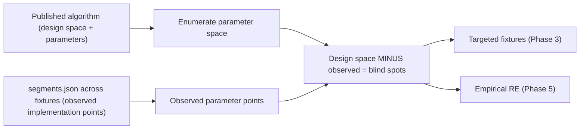

# Columnstore algorithm-to-implementation map

Living index that ties each **published** columnstore algorithm to the **closed**
on-disk implementation `mssqlbak` reverse-engineers. The algorithms are public
(Larson, Zukowski, Abadi, Lemire, the MS-XCA / MS-XLDM / MS-DICT specs); the
byte layout is not. The gap between the published design space and the parameter
points observed in fixtures is where decode bugs hide.

This doc is the design-space half of the blind-spot model and the module index
for `mssqlbak/columnstore/` (the package split in Phase 0). It is consumed by the
[Columnstore Coverage Overhaul plan](COLUMNSTORE_COVERAGE_OVERHAUL_PLAN.md):
Phase 2's `columnstore_matrix.py` fills in the observed-points column, Phase 3
generates fixtures for unobserved points, and Phase 5 reverse-engineers the
formats still tagged `[EMPIRICAL]`.

## The blind-spot model

Each segment row in a `<bak>.segments.json` sidecar (produced by
[tools/capture_verifier_sidecar.py](../tools/capture_verifier_sidecar.py)) is one
observed point in an algorithm's parameter space. The **Observed** column below is
populated from the Phase 2 matrix once `columnstore_matrix.py` lands; until then it
records what current fixtures are known to exercise.

## How to read each entry

- **Source** — the published algorithm or spec, by short tag (see
  [CORROBORATION_SOURCES.md](CORROBORATION_SOURCES.md)).
- **Fixed** — what the paper/spec pins down.
- **Code** — the `mssqlbak/columnstore/` module and symbol. Line numbers are
  omitted on purpose; the Phase 0 split moved symbols verbatim, so resolve by
  symbol name.
- **Observed** — parameter points current fixtures exercise.
- **Blind spots** — published design-space points not yet observed; these seed
  Phase 3 fixtures and Phase 5 RE.

Spec confidence tags match [BAK_FORMAT_SPEC.md](BAK_FORMAT_SPEC.md): `[CONFIRMED]`,
`[CORROBORATED]`, `[EMPIRICAL]`.

---

## A1. Value encoding / Frame-of-Reference (FOR) — enc=1, enc=4

- **Source**: `L11` §2.2.1 (canonical `actual = (stored + base_id) / 10^exp`),
  `Z09` §6.2 (classical FOR `stored = c - block_min`), `STAIR4`
  (`base_id`/`magnitude`), Paul White (DBCC CSINDEX `BaseId`/`Magnitude`/`MinDataId`).
- **Fixed**: a per-segment base + scale; reconstruct with
  `actual = base_id + stored * magnitude` (or the decimal-exponent variant).
- **Code**: [decode/value_for.py](../mssqlbak/columnstore/decode/value_for.py)
  (`_apply_mag`, `_decode_enc1`, `_int_to_python`, `_enc4_null_sentinel`);
  FOR base for bit-packed indices in
  [decode/bitpack.py](../mssqlbak/columnstore/decode/bitpack.py) (`_bp_for_base`).
  `Z09` confirms CCI stores **absolute** biased values, not block-relative.
- **Observed**: enc=1 integer/temporal across the standard type fixtures; enc=4
  raw 64-bit.
- **Blind spots**: (1) negative-exponent decimal vs integer scale direction across
  every `decimal(p,s)` / `money` precision; (2) `null_value` sentinel choice for
  small segments — "not publicly documented" per `N32` / `DARLING-RGE`;
  (3) `base_id + stored` near the 64-bit boundary for `bigint`.
  `cci_bitpack_probe_bigint` is **not** a FOR bug — its failure is an A6 row-group
  tombstone overshoot.

## A2. Bit-packing — the packing primitive under enc=1/2/3

- **Source**: `LB15` / FastPFor, `FASTLANES23`, `WILLHALM09`, Paul White
  (64-bit unit = 7 × 9-bit subunits → 32,256-row boundary), `D19` survey.
- **Fixed**: N values packed into 64-bit words at `bpv` bits each; `vpw = 64 // bpv`.
- **Code**: [decode/bitpack.py](../mssqlbak/columnstore/decode/bitpack.py)
  (`_BP_*` consts, `_true_bp_start`, `_bitpack_values`, `_n_rows_from_blob`).
- **Observed**: the `cci_bitpack_probe*` fixtures sweep `bpv` via distinct-count
  control; the >32,767-row boundary is partially covered.
- **Blind spots**: (1) every `bpv` width 1..64 per type not enumerated;
  (2) the 9-bit / 7-subunit packing artifact at the >32,767-row boundary, only
  partially covered; (3) `bpv = 0` off-row MAX returns `None` today (A5);
  (4) whether SS2022/SS2025 switched to a FastLanes-style transposed-lane layout —
  unverified, would silently corrupt if it did.

## A3. RLE and hybrid RLE + bit-packing — enc=1/2/3

- **Source**: `ABADI06` (RLE + bit-packing + null-suppression on compressed data),
  `L11` §2.2.3.
- **Fixed**: runs of repeated values plus a bit-packed exception region.
- **Code**: [decode/bitpack.py](../mssqlbak/columnstore/decode/bitpack.py)
  (hybrid fragment table, `su >= 0x8000_0000` bit-offset refs vs direct RLE runs,
  FOR-base bias 3 via `_bp_for_base`), consumed from
  [decode/value_for.py](../mssqlbak/columnstore/decode/value_for.py).
- **Observed**: hybrid fragment + RLE in the bitpack-probe fixtures.
- **Blind spots**: (1) pure-RLE-only segments with no bit-pack region;
  (2) multi-fragment ordering and the fragment `field1` block-type indicator
  (`Z09` null-zone detection, not FOR); (3) very long single runs.

## A4. Dictionary encoding — enc=2 numeric, enc=3 string (v2 / v4 / v7)

- **Source**: `L11` / `L15` (string dictionary), `MS-XLDM` §2.3.2 + `MS-DICT`
  (`type` 1/3/4 = int/string/float), `XMHUFFMAN`, `D0NK-VPAQ`, `HUGO-DICT`,
  `PBIXRAY-DICT` (VertiPaq / xVelocity family).
- **Fixed**: bit-packed data-ids index a dictionary; large dicts use
  canonical-Huffman 128-entry pages (xVelocity); a sibling-of-MS-XLDM layout.
- **Code**:
  - enc=2 numeric: [decode/dict_numeric.py](../mssqlbak/columnstore/decode/dict_numeric.py)
    (`_parse_numeric_dict_int`, `_decode_enc2_int_dict`, `_decode_enc2_float_dict`).
  - enc=3 string + MAX-dict: [decode/dict_string.py](../mssqlbak/columnstore/decode/dict_string.py)
    (`_parse_dict_strings`, `_parse_max_dict_entries/_strings/_bytes`, `_decode_enc3`).
  - v4 Huffman / v7 sorted-pool: [decode/dict_xvelocity.py](../mssqlbak/columnstore/decode/dict_xvelocity.py)
    (`_decode_v4_huff_dict`, `_split_v4_record`, `_find_v7_sorted_pool`,
    `_parse_v7_sorted_pool`). v4 confirmed 1200/1200 against `G44.json`.
- **Observed**: v2 small, v4 Huffman, MAX-dict across the string-type fixtures;
  v7 bookmark strings only.
- **Blind spots**: (1) v7 sorted-pool **compact** step format (only bookmark
  strings decode without Huffman); (2) `dict_type` 1/3/4 cross-product per type;
  (3) the `CHAR(N)` doubled-record split heuristic (`width >= 32`) is fragile;
  (4) sort-key-only dictionaries (index out-of-range → `None`); (5) global /
  secondary dictionary shared across segments vs per-segment.

## A5. XPRESS / MS-XCA Huffman — enc=5 multichunk, ARCHIVE

- **Source**: `MS-XCA` (Huffman construction + processing), Kraft-McMillan,
  `L13` / `L13-CMU` (ARCHIVE wraps xVelocity segments).
- **Fixed**: LZ77 + canonical Huffman; ARCHIVE adds a second compression layer over
  the segment.
- **Code**: [decode/enc5_raw.py](../mssqlbak/columnstore/decode/enc5_raw.py)
  (`_decode_enc5`, `_decode_enc5_multichunk_xpress`, `_decode_enc5_archive`,
  `_decode_enc5_archive_subblock_compressed`, Format A–D paths); ARCHIVE blob unwrap
  in [storage/lob.py](../mssqlbak/columnstore/storage/lob.py) (`_unwrap_archive_blob`).
  The XPRESS/LZ77 inner decompress is the Rust `xpress_lz77` extension.
- **Observed**: enc=5 single/multichunk and single-layer ARCHIVE across the
  `archive_*` fixtures.
- **Blind spots**: (1) ARCHIVE **double-compressed inner sub-block** layout
  `[EMPIRICAL]`; (2) enc=5 **Format A–D** exact byte layouts `[EMPIRICAL]`
  (`BAK_FORMAT_SPEC` §7.7); (3) the 32,768-row null-bitmap sub-block (no open
  publication); (4) SS2022 QAT / hardware backup compression is a container concern,
  not columnstore.

## A6. Delta store + delete/update bitmap — CCI updateability (SS2014+)

- **Source**: `L13` (delete bitmap = B-tree of `(row_group_id, row_number)`),
  `HEMAN10` (positional delta trees), Korotkevitch delta/delete-bitmap, `N32`
  (small rowgroups), Neugebauer part 22 (invisible / tombstone row groups).
- **Fixed**: new rows in a B-tree delta store; deletes/updates tracked in a
  deleted-row bitmap, not in the compressed segment.
- **Code**: delta-store rows in
  [assembly/delta.py](../mssqlbak/columnstore/assembly/delta.py)
  (`_read_columnstore_delta_rows`, tombstoned-delta detection); the tombstone
  row-group filter for compressed groups in
  [assembly/reader.py](../mssqlbak/columnstore/assembly/reader.py)
  (`sum(n_rows) > rcrows` greedy filter). The delete bitmap is **not parsed** — a
  tracked gap in [tools/known_gaps.py](../tools/known_gaps.py)
  (`dirtycoverage_cci_delete` / `_update`).
- **Observed**: delta-store reads; tombstoned-delta detection; REORGANIZE-merge
  tombstones.
- **Blind spots**: (1) delete-bitmap allocation + per-rowgroup row-number
  application; (2) `state_desc` OPEN/CLOSED/INVISIBLE/TOMBSTONE in live row counts —
  the `COMPRESS_ALL_ROW_GROUPS` mid-sequence tombstone case
  (`cci_bitpack_probe_bigint`) is unresolvable from the page image alone (see the
  `rowgroups` diag subcommand and the plan's diagnostic playbook); (3) compression-
  delay open delta at backup time.

## A7. Ordered CCI + segment elimination (SS2022), online rebuild (SS2025)

- **Source**: the [columnstore evolution doc](Columnstore%20indexes%20have%20evolved%20from%20a%20.md)
  §5–6, MS ordered-columnstore docs.
- **Fixed**: data physically sorted by key before compression; tighter segment
  min/max for elimination; SS2025 online rebuild + auto-elimination.
- **Code**: ordered CCI decodes through the same segment path in
  [assembly/reader.py](../mssqlbak/columnstore/assembly/reader.py) — sort changes
  value order, not the byte encoding. One fixture today (`ordered_cci_full`).
- **Observed**: a single ordered-CCI fixture.
- **Blind spots**: (1) whether ordered vs unordered changes any dictionary/segment
  bytes per type (assumed identical, unverified); (2) SS2025 online-rebuild /
  auto-elimination structural changes, entirely unobserved.

## A8. NCCI on heap / rowstore / filtered (SS2016+)

- **Source**: evolution doc §3, `RG-CCI1` / `RG-CCI2`.
- **Fixed**: columnstore as a secondary index over a heap / B-tree base; optional
  filter predicate.
- **Code**: segment decode reused via
  [assembly/reader.py](../mssqlbak/columnstore/assembly/reader.py); the base-table
  row mapping differs and lives on the rowstore extract path.
- **Observed**: `ncci_heap_full`, `ncci_types_full`, `filtered_ncci_full`,
  `cci_btree_nci_full`.
- **Blind spots**: (1) NCCI delete-bitmap vs CCI; (2) filtered-NCCI row-subset
  reconciliation against the base table; (3) interplay with a B-tree NCI.

## A9. Columnstore on memory-optimized (Hekaton / XTP) — out of scope

- **Source**: `H13`, `FREED14`, `HKCC12`.
- **Code**: XTP tables are detected and **skipped** (data lives in checkpoint files,
  not pages).
- **Status**: out of scope. The matrix records these cells as `out-of-scope`, never
  silently absent.

---

## Version-divergent branches

The Phase 0 split kept the ~3 version-specific branches inline in their encoding
modules rather than in a central dispatcher. They are not yet tagged with the
`# VERSION: <Vnn>` convention the plan calls for; tagging them so
`rg "# VERSION:" mssqlbak/columnstore/` is the canonical inventory is a follow-up.

- **enc=2 "non-biased" magnitude + null sentinel** (SS2016 and earlier) —
  [decode/value_for.py](../mssqlbak/columnstore/decode/value_for.py), inside the
  enc=1/enc=2 value path. (spec V05)
- **`prim_dict` vs `sec_dict` dictionary-id selection** for older versions —
  [assembly/reader.py](../mssqlbak/columnstore/assembly/reader.py).
- **ARCHIVE (cmprlevel=4) detection** —
  [assembly/reader.py](../mssqlbak/columnstore/assembly/reader.py) /
  [storage/lob.py](../mssqlbak/columnstore/storage/lob.py) (`_unwrap_archive_blob`).
  (spec V07)

## How this drives the plan

- Phase 2 `columnstore_matrix.py` becomes the observed-points half of the model:
  each `segments.json` tuple is one observed point per algorithm.
- Phase 3 generates fixtures for the unobserved A1–A8 points above.
- Phase 5 promotes `[EMPIRICAL]` → `[CORROBORATED]` / `[CONFIRMED]` for the formats
  whose byte layout is still inferred (A4 v7 compact, A5 Format A–D / ARCHIVE inner,
  A6 delete bitmap).
