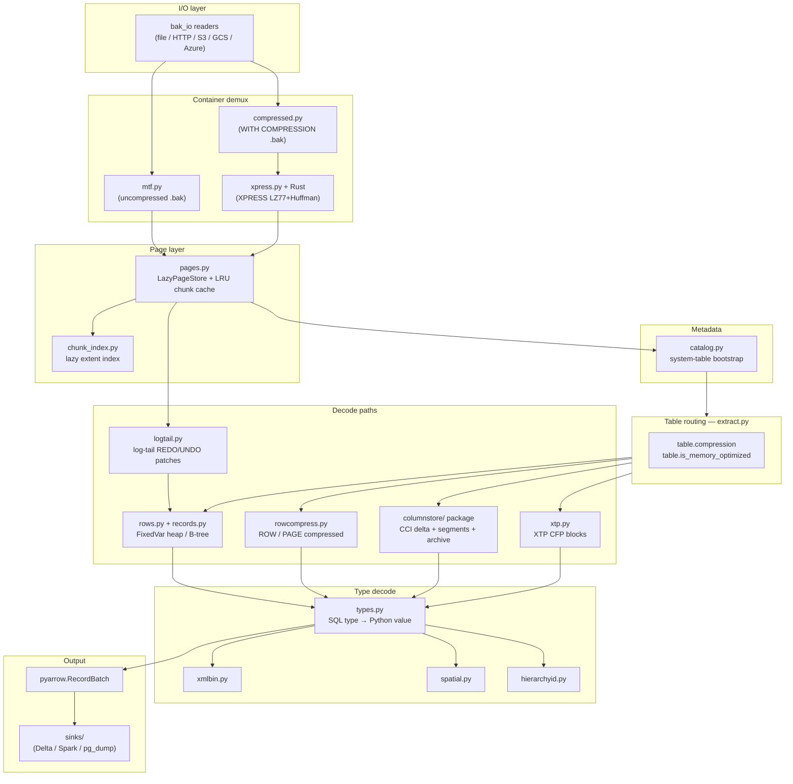

# Architecture — decode pipeline

This document describes the decode pipeline from `.bak` file to Arrow
`RecordBatch`.  For byte-level format details, see
[`docs/spec/00_MASTER.md`](../spec/00_MASTER.md).

---

## Decode pipeline

---

## I/O layer (`mssqlbak/bak_io.py`, `mssqlbak/readers/`)

`open_bak(path_or_url)` returns a seekable, mmap-backed file object or an
HTTP/S3/GCS/Azure streaming reader.  All downstream modules receive this
object; none open files directly.

HTTP readers coalesce adjacent reads into a single range request for sequential
scan access patterns.

---

## Container demux

Two mutually exclusive code paths depending on the backup type:

**Uncompressed (`mtf.py`)** — walks Microsoft Tape Format (MTF) descriptor
blocks to locate the embedded MDF data-stream extents and builds a
`{(file_id, page_id): offset}` index into the backup file.

**Compressed (`compressed.py`)** — reads the MSSQLBAK chunk-stream header,
decompresses XPRESS extents on demand via `xpress.py` (Rust fast path), and
reconstructs a contiguous MDF page image with the v2 +4-byte overlap applied.
`chunk_index.py` holds the lazy decompression index so extents are only
inflated when a page within them is needed.

---

## Page layer (`mssqlbak/pages.py`)

`LazyPageStore` maps `(file_id, page_id)` to 8 KB page bytes.  It applies:

- **Torn-page restoration** (gated on `m_flagBits & 0x100`) — restores the
  low 2 bits of each sector-boundary byte from `m_tornBits` pairs.
- **LRU chunk cache** — decompressed extents are cached up to a configurable
  byte limit (default ~16 MB, auto-scaled by `_memcap.py`).

---

## Metadata bootstrap (`mssqlbak/catalog.py`)

`build_catalog(page_store)` reads system base tables in dependency order:

1. Boot page (page 9) → `dbi_collation`, database DBINFO LSNs.
2. `sysallocunits` — located via fixed offset 516 in the boot page; page scan
   is the fallback.
3. `sysrowsets` → `sysrscols` → `syscolpars` → `sysschobjs` → `sysclsobjs`.
4. XTP detection per-table: `sysrowsets.status & 0x100` + null alloc pointers.

The result is a `Catalog` containing `Table` objects, each with typed `Column`
lists and `alloc_unit` pointers for all indexes.

---

## Table routing (`mssqlbak/extract.py`)

Routing is driven by two `Table` attributes:

| Condition | Decode path |
|---|---|
| `table.is_memory_optimized` | `xtp.py` — XTP CFP blocks |
| `table.compression in (3, 4)` or CCI alloc present | `columnstore/` package |
| `table.compression in (1, 2)` | `rowcompress.py` — ROW/PAGE compressed |
| default | `rows.py` + `records.py` — heap or B-tree FixedVar |

"StoragePath" labels (ROWSTORE_HEAP, COLUMNSTORE_SEGMENT, etc.) are spec
abstractions used in [`docs/spec/`](../spec/00_MASTER.md); they do not
correspond to code symbols.

---

## Decode paths

### Rowstore heap / B-tree (`mssqlbak/rows.py`, `mssqlbak/records.py`)

`read_table_rows(table, page_store, catalog)` (`rows.py:1132`):

1. Walks the IAM chain (`SPA@140`, bitmap@194, extent = 8 pages) to enumerate
   data pages for heap tables.  For clustered indexes, descends the B-tree
   to the leftmost leaf page, then follows `next_page` links.
2. For each data page, calls `decode_record(raw)` (`records.py:69`) which
   parses the FixedVar format: status bytes, `pminlen`, null bitmap, fixed
   section, variable-offset array, variable section.
3. Feeds raw column bytes into `types.py` per column descriptor.
4. Applies LOB stitching for off-row values (`stitch_lob` Rust fast path in
   `rows.py`; Python fallback via `_read_lob_node`).

### ROW/PAGE compressed (`mssqlbak/rowcompress.py`)

Handles CD-format records produced by `WITH ROW / PAGE COMPRESSION`.
`decode_compressed_value` resolves the CD encoding for each physical column,
applying:

- Short/long region pointer geometry (`_short_region_pointers`,
  `_long_region` with `0x8000` complex flag).
- PAGE compression: anchor prefix + dictionary substitution via
  `_expand_prefix`.
- `vardecimal` compression decoder.
- `nchar`/`nvarchar`: selects UTF-16LE (even byte-length) or SCSU (odd
  byte-length) via `scsu.py` / Rust `scsu_expand`.

### Columnstore (`mssqlbak/columnstore/`)

Delta store tables (`__cs_delta_*`) re-enter the rowstore path, then pass
through `assembly/delta.py` for tombstone suppression
(`_choose_exact_active_segments` exact subset-sum, greedy fallback).

Closed segment tables go to `assembly/reader.py`:

1. `storage/segment_meta.py` — reads `syscscolsegments` /
   `syscsdictionaries` for each column's encoding, row count, and blob
   location.
2. `storage/lob.py` — fetches and deinterleaves the columnstore LOB blobs;
   unwraps ARCHIVE blobs.
3. `decode/` modules — decode each encoding:
   - enc=1: `value_for.py` (`_decode_enc1`, `_int_to_python`) — plain integer
     / temporal / float with FOR offset from the segment meta.
   - enc=2: `dict_numeric.py` — numeric hash-dictionary lookup.
   - enc=3: `dict_string.py` — string dictionary with up to three merge
     modes (`_combine_enc3_dicts`).
   - enc=4: `value_for.py` — like enc=1 with null sentinel
     (`_enc4_null_sentinel`).
   - enc=5: `enc5_raw.py` — ARCHIVE formats A/B/C/D (VLD-page,
     multichunk XPRESS, headerless second-chunk).
   - xVelocity v4/v7: `dict_xvelocity.py` — Huffman string dicts via
     `xmhuffman` or Python fallback.
4. `decode/bitpack.py` — FOR + bit-unpack accelerated by numpy.
5. Rust `decode_cs_segment` accelerates the inner segment decode loop.

### XTP (`mssqlbak/xtp.py`)

`scan_cfp_log_records` scans CFP blocks in the `.bak` stream.  Two block
formats:

- Compact (`0x0001000d` / `0x0001000e`) — 40-byte block header, 20-byte
  insert records.
- WAL (`0x00030050`) — framed log records with alignment-padded fixed
  section + variable section.

Completeness gate: `_seq_complete_rows` (seq-contiguity) and
`_dense_identity_rows` (dense-identity) must both pass before a row is emitted.

### Log tail (`mssqlbak/logtail.py`)

For online / fuzzy backups, `find_log_range` walks all APAD/MSLS segments to
locate the log tail, then `apply_log_patches` replays committed REDO records
(INSERT, DELETE, MODIFY) onto the page store.  MODIFY patches use
`round4(undo_size)` alignment.  A page is patched only when its LSN is
strictly less than the record LSN.

---

## Rust / Python split

| Hot path | Rust export | Python fallback |
|---|---|---|
| XPRESS decompress | `lz77_huffman_decompress` | `xpress.py` (raises error in production) |
| MSSQLBAK header scan | `find_next_mssqlbak_header_py` | `compressed.py` linear scan |
| Page → columnar values | `decode_page_to_columns` | `pages.py` Python parse |
| Compressed page → columnar | `decode_compressed_page_to_columns` | `rowcompress.py` |
| SCSU expand | `scsu_expand` | `scsu.py` |
| LOB stitch | `stitch_lob`, `stitch_lob_images`, `stitch_text_ptr` | `rows.py` `_read_lob_node` |
| BCP columns | `parse_bcp_columns` | `bacpac.py` |
| CS segment decode | `decode_cs_segment` | `columnstore/decode/*` |

The Python fallbacks are active when the native extension is not built or when
the Rust path encounters an unhandled variant.

---

## Streaming and batch model

All decode paths are generators; rows are never fully materialized in memory.
`extract.py` collects rows into Arrow `RecordBatch` objects at a fixed batch
size and writes each batch to the sink before moving to the next.  The only
full-page materialization is within `LazyPageStore` (bounded by the LRU cache).
